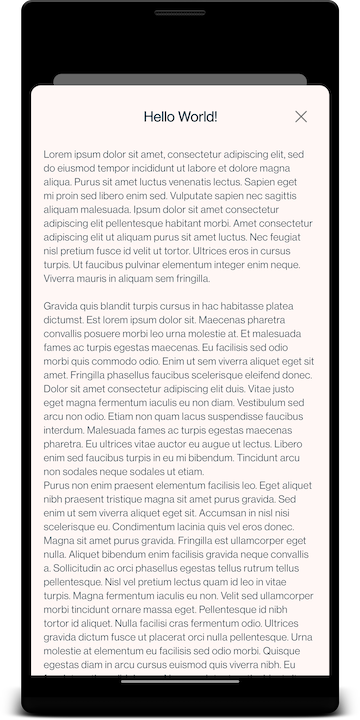
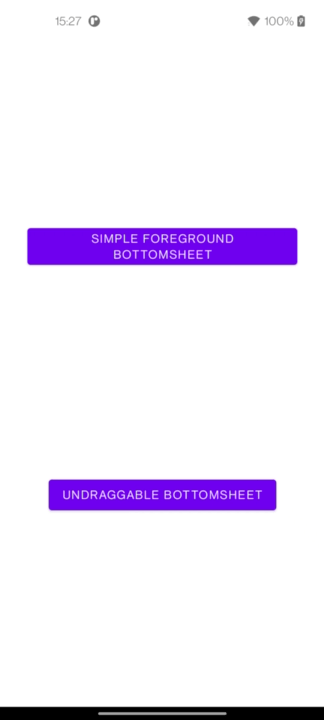

# Foreground BottomSheet

Android library to display a BottomSheet in foreground and pass the activity into background.



## How to install

:warning: In Progress :warning:

## How to use

#### 1. Create the layout

```xml
<?xml version="1.0" encoding="utf-8"?>
<FrameLayout xmlns:android="http://schemas.android.com/apk/res/android"
    android:layout_width="match_parent"
    android:layout_height="match_parent"
    android:paddingTop="40dp">

    <androidx.constraintlayout.widget.ConstraintLayout
        android:layout_width="match_parent"
        android:layout_height="match_parent"
        android:background="@drawable/bg_foreground_bottomsheet"
        android:backgroundTint="YOUR_BACKGROUND_COLOR_HERE">

        <!-- Your layout here -->

    </androidx.constraintlayout.widget.ConstraintLayout>

</FrameLayout>
```

#### 2. Create your ForegroundBottomSheet

```kotlin
import com.mbiamont.foregroundbottomsheet.ForegroundBottomSheet

class ExampleForegroundBottomSheet : ForegroundBottomSheet() {

    override fun onCreateView(inflater: LayoutInflater, container: ViewGroup?, savedInstanceState: Bundle?): View? {
        return inflater.inflate(R.layout.YOUR_LAYOUT_HERE, container, false)
    }
}
```

#### 3. Show/Dismiss

`ForegroundBottomSheet` is a simple `BottomSheetDialogFragment`, so you can show it or dismiss it using the same functions.

Example

```kotlin

class MainActivity : AppCompatActivity() {
    
    fun openForegroundBottomSheet() {
        ExampleForegroundBottomSheet().show(supportFragmentManager, "YOUR_TAG")
    }
}
```

```kotlin
class ExampleForegroundBottomSheet : ForegroundBottomSheet() {

    override fun onViewCreated(view: View, savedInstanceState: Bundle?) {
        closeDialogButton.setOnClickListener {
            dismiss()
        }
    }
}
```

## Customization

#### Draggable

By default, a `ForegroundBottomSheet` can be closed when dragged down.0


It can be disabled by overriding the method `onCreateBottomSheetBehavior()`

Example:

```kotlin
override fun onCreateBottomSheetBehavior(behavior: BottomSheetBehavior<View>) {
    super.onCreateBottomSheetBehavior(behavior)
    behavior.isDraggable = false
}
```

The `BottomSheet` won't be able to be closed when dragging down.

